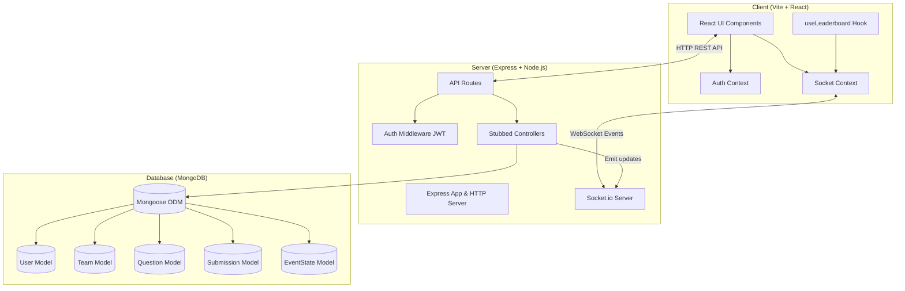

# 🧩 Quiz & Riddle Competition Platform (EnigmaGrid)

A robust, real-time MERN-stack monorepo application powered by **Socket.io** for hosting real-time team-based technical quizzes and interactive riddle competitions.

---

## 🏗 System Architecture



---

## 📂 Monorepo Structure

```text
Quiz_Riddle/
├── .gitignore
├── README.md
├── server/                   # Express + MongoDB + Socket.io Backend
│   ├── package.json
│   ├── .env.example
│   └── src/
│       ├── server.js         # Entry point (HTTP + Socket.io + Express)
│       ├── config/db.js      # Mongoose DB connection setup
│       ├── models/           # Mongoose schemas (User, Team, Question, etc.)
│       ├── middleware/       # JWT & Role authorization middlewares
│       ├── routes/           # REST endpoints (auth, team, question, etc.)
│       └── controllers/      # Controller handlers
└── client/                   # React + Vite + Dynamic CSS Frontend
    ├── package.json
    ├── vite.config.js
    ├── index.html
    └── src/
        ├── App.jsx           # Main application routing & tab view
        ├── index.css         # Modern HSL Dark design system
        ├── components/       # UI Components (Leaderboard, QuestionCard, etc.)
        ├── context/          # Context Providers (AuthContext, SocketContext)
        ├── pages/            # View Pages (Auth, Lobby, Arena, Admin)
        └── hooks/            # Custom Hooks (useLeaderboard)
```

---

## 🚀 Quick Start Guide

### Prerequisites
- **Node.js**: `v18.0.0` or higher
- **npm**: `v9.0.0` or higher
- **MongoDB**: Local instance (`mongodb://localhost:27017`) or MongoDB Atlas connection URI

---

### 1. Backend Setup (`/server`)

```bash
# Navigate to server directory
cd server

# Install backend dependencies
npm install

# Setup environment variables
cp .env.example .env

# Run server in development mode (with nodemon)
npm run dev

# Or start in production mode
npm run start
```

The server will launch at `http://localhost:5000`.

---

### 2. Frontend Setup (`/client`)

```bash
# Open a new terminal tab/window and navigate to client directory
cd client

# Install frontend dependencies
npm install

# Run Vite dev server
npm run dev
```

The React frontend will launch at `http://localhost:5173`.

---

## 🗝 Key Features & Specs

- **Real-Time Leaderboard**: Live rank updates broadcasted over Socket.io (`leaderboard:update`).
- **Team Management**: Create teams, join using unique 6-character access codes.
- **Dynamic Question Types**: MCQ and Riddle handling with automated answer validation.
- **Admin Control Panel**: Freeze leaderboards, start/pause round access, manage question sets.
- **JWT Authentication & RBAC**: Admin and Participant role authorization.